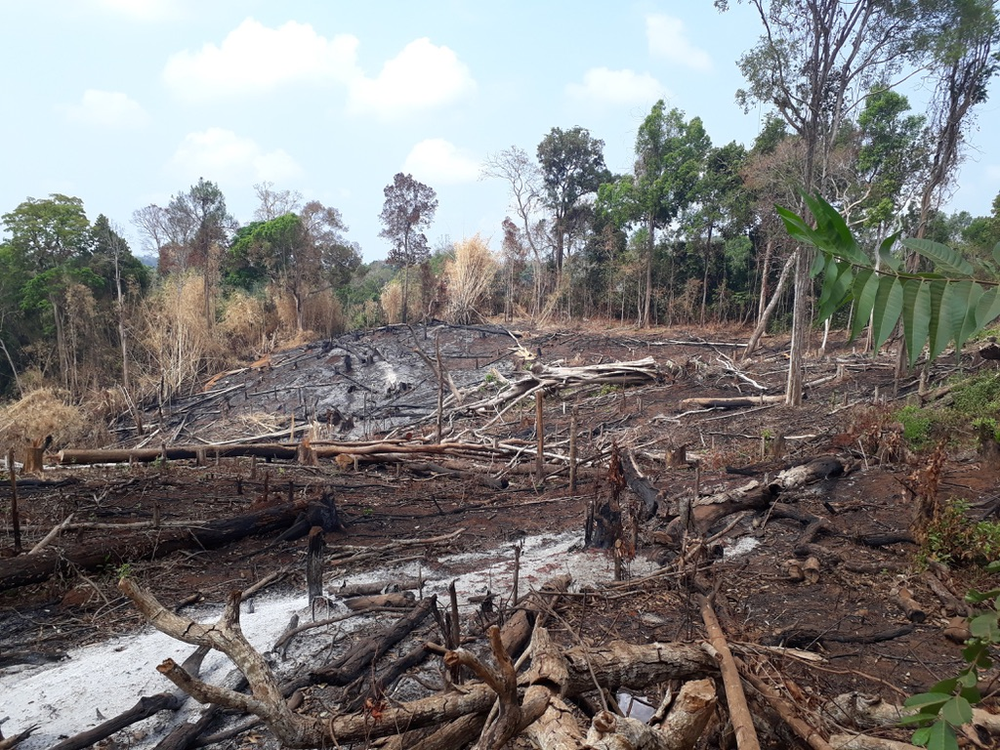

# Understanding malaria transmission and vectors ecology in Cambodia through machine learning

## Description

An open-source project analysing malaria vectors ecology in Cambodia using machine learning, based on data collected during my PhD, motivated by my will to participate to universal access to knowledge, support open science, and f**k Elsevier et al.
Anyone is free to participate, even though the data is already a few years old and it is a pretty niche interest. I just believe in open data, and who knows, it might be useful to someone.

- Collection dates: 2019-2020
- Collection sites: Kaev Seima District, Mondulkiri Province, Cambodia
- Affiliation: Molecular Malaria Epidemiology Unit, Pasteur Institute of Cambodia

Some relevant Research:
 - paper 1
 - paper 2

## Contributing

Details on how to contribute to the project.

1. Fork the Project
2. Create your Feature Branch (`git checkout -b feature/AmazingFeature`)
3. Commit your Changes (`git commit -m 'Add some AmazingFeature'`)
4. Push to the Branch (`git push origin feature/AmazingFeature`)
5. Open a Pull Request

## License

Distributed under the MIT License. See `LICENSE` for more information.

## Contact

Anaïs Pepey, PhD - [portfolio](https://apepey.notion.site/Ana-s-Pepey-PhD-5086e0b7c889490abfa67625339825f8) - [email](mailto:ana.pepey@posteo.net)

Project Link: [https://github.com/APepey/malaria-kh](https://github.com/APepey/malaria-kh)

## Photo gallery

Parcel of forest cleared with the slash-and-burn method to make space for agriculture:

Determined PhD student braving the elements to collect mosquitoes:

